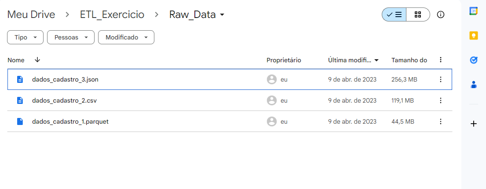
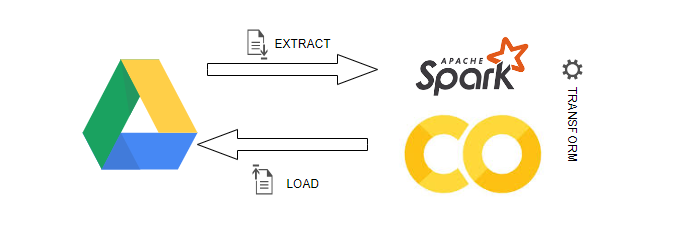
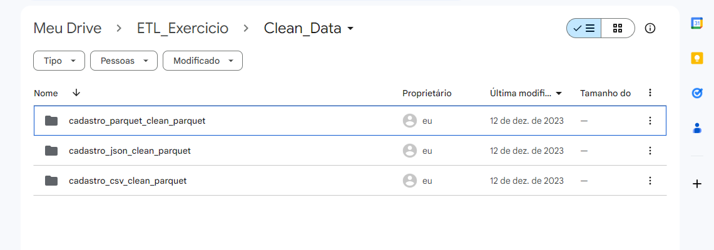
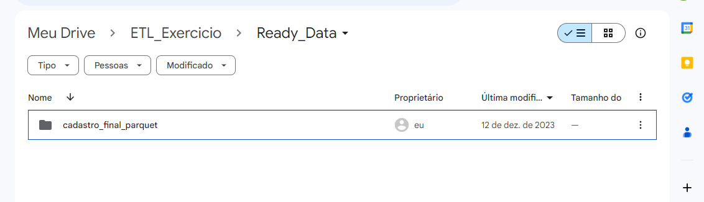

# Visão Geral do Projeto
Neste projeto temos 3 arquivos (.csv, .parquet , .json) com dados cadastrais de pessoas físicas. Os dados vieram de bancos de dados diferentes, por isso, possui algumas diferenças entre os dados. 
O entregável é um script de extensão .py que vai ler os dados de entrada e gerar uma tabela única no final, contendo todos os cadastros íntegros e tratados.
Para isso será desenvolvido um script no Spark que vai ler os 3 arquivos, aplicar várias transformações mantendo a integridade dos dados, trazendo no final as colunas em comum dos 3 arquivos.

# Fontes de Dados
As bases de dados após serem recebidas foram armazenadas no Google Drive na pasta Raw_Data da pasta ETL_Exercício na aba Meu Drive.
1. Arquivo CSV: dados_cadastro_2.csv
2. Arquivo Parquet: dados_cadastro_1.parquet
3. Arquivo Json: dados_cadastro_3.json

# Fluxo de Dados
1. Extração das bases foi feita do Drive através de uma conexão. 
2. Transformação foi feita em Google Colab utilizando Spark Dataframe e Spark SQL.
3. Carga foi feita no Drive na pasta Ready_Data com os dados em formato parquet.

# Metadados Antes das Transformações
* Cpf ou documento_cpf: Número do cpf do cliente com 9 dígitos, string
* nome, nome_completo: Nome do cliente, string
* data_nascimento: data de nascimento dia, mês, ano, string
* sexo: gênero do cliente Fem ou F (feminino) e Masc e M (masculino), string
* convenio: nome do convenio do cliente, string
* logradouro: rua da residência do cliente, string
* numero: número da residência do cliente, string
* bairro: bairro da residência do cliente, string
* cidade: cidade da residência do cliente, string
* estado ou uf: estado da residência do cliente, string
* data_cadastro: timestamp da data de cadastro, string
* pais_cadastro ou pais: país onde foi realizado o cadastro do cliente
* __inde__level__0: sequência de números, string

# Desenvolvimento do Projeto
## Linguagem utilizada: 
1. Spark Dataframe
2. Spark SQL
   
## Bibliotecas:
* !pip install pyspark
* !pip install unidecode
* from pyspark.sql import SparkSession
* from pyspark.sql import functions as F
* from pyspark.sql.types import StringType, TimestampType
* from pyspark.sql.window import Window
* from unidecode import unidecode 

## Transformações no Arquivo Csv
1. Remoção de pronomes de tratamento da coluna nome (Sr., Srta., Dr., Dra., Sra.).
2. Modificação da tipagem dos dados da coluna data_nascimento (string para date) e data_cadastro (string para datetime).
3. Substituição dos registros Fem e Masc para F e M na coluna sexo.
4. Padronização dos registros da coluna cidade para que as todas letras inicias do dado se iniciem com letra maiúscula.
5. Remoção de caractere (.0) da coluna numero.
6. Substituição do registro Br da coluna pais_cadastro para Brasil.
7. Remoção de acentos presentes nas colunas: nome, convenio, logradouro, bairro, cidade.
8. Exclusão de cpf duplicado. Para isso foi criado uma partição (grupo) por cpf ordenada pela data_cadastro com ordenação desc (ou seja, os cpfs iguais seriam “agrupados” e ordenados a partir da coluna data_cadastro) e foi adicionado uma coluna numerada com row_number para filtrar os valores de cada grupo de cpf (ou seja, cada um dos cpfs de um grupo recebeu uma numeração ranqueada a partir da sua data de cadastro, sendo 1 a data mais recente). A partir disso foi realizado um filtro na coluna de raqueamento para que apenas registro igual a 1 (data mais recente)fosse mantoido .
9. Padronização dos nomes (escrito em CAPS LOCK) e da sequência das colunas após o tratamento: CPF, NOME, DATA_NASCIMENTO, SEXO, CONVENIO, LOGRADOURO, NUMERO, BAIRRO, CIDADE, ESTADO, DATA_CADASTRO, PAIS_CADASTRO

## Transformações no Arquivo Parquet
1. Remoção de pontuação da coluna documento_cpf.
2. Remoção de pronomes de tratamento da coluna nome (Sr., Srta., Dr., Dra., Sra.).
3. Modificação da tipagem dos dados da coluna data_nascimento (string para date) e data_cadastro (string para datetime).
4. Substituição dos registros Fem e Masc para F e M na coluna sexo.
5. Padronização dos registros da coluna cidade para que as todas letras inicias do dado se iniciem com letra maiúscula.
6. Exclusão da coluna __inde__level__0.
7. Remoção de acentos presentes nas colunas: nome, convenio, logradouro, bairro, cidade.
8. Padronização dos nomes (escrito em CAPS LOCK) e da sequência das colunas após o tratamento: documento_cpf as CPF, nome_completo as NOME, data_nascimento as DATA_NASCIMENTO, sexo as SEXO, convenio as CONVENIO, logradouro as LOGRADOURO, numero as NUMERO, bairro as BAIRRO, cidade as CIDADE, uf as ESTADO, data_cadastro as DATA_CADASTRO, pais as PAIS_CADASTRO

## Transformações no Arquivo Json
1. Padronização dos registros da coluna cidade para que as todas letras inicias do dado se iniciem com letra maiúscula.
2. Remoção de pontuação da coluna cpf.
3. Modificação da tipagem dos dados da coluna data_nascimento (string para date) e data_cadastro (long para datetime).
4. Remoção de pronomes de tratamento da coluna nome (Sr., Srta., Dr., Dra., Sra.).
5. Conversão dos nomes dos estados para siglas na coluna estado.
6. Remoção de acentos presentes nas colunas: nome, convenio, logradouro, bairro, cidade.

Cada base de dados após as transformações foi salva em parquet na pasta clean_data no google drive.

## União dos dados
E para unir os arquivos limpos em uma base de dados final foi utilizados Spark SQL com a função UNION ALL nas três bases.
Assim foi gerada uma base final com o nome de cadastro_final que foi escrita em parquet e salva no google drive na pasta Ready_Data.

## Metadados Final
* CPF: Número do cpf do cliente com 9 dígitos, string
* NOME: Nome do cliente, string
* DATA_NASCIMENTO: Data de nascimento do cliente yyyy-MM-dd, date
* SEXO: Gênero do cliente F (feminino) ou M (masculino)
* CONVENIO: Nome do convenio do cliente, string
* LOGRADOURO: Rua da residência do cliente, string
* NUMERO: Número da residência do cliente, string
* BAIRRO: Bairro da residência do cliente, string
* CIDADE: Cidade da residência do cliente, string
* ESTADO: Estado da residência do cliente, string
* DATA_CADASTRO: Timestamp do cadastro, timestamp
* PAIS_CADASTRO: País onde foi realizado o cadastro do cliente, string

# Resultado
Base de dados final contendo todos os cadastros íntegros e tratados pode ser carregada em um Banco de Dados ou Data Lake. Para posterior uso em construção de dashboard informacionais ou para criação de varáveis preditivas para ML.  
